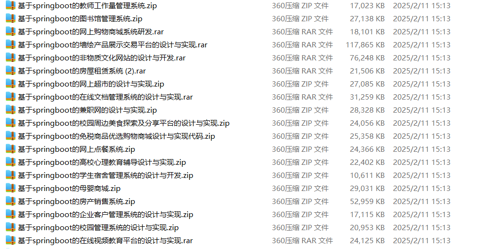

# springboot_collaborative_filtering_liquor_specialty_product_recommendation

📦 SpringBoot多功能项目仓库 🎯

本仓库汇集了三个基于 **Spring Boot** 开发，并结合**协同过滤算法**的推荐系统，涵盖**白酒销售推荐**、**特产销售优化**、**智能商品推荐**等多个领域，适用于**酒类电商**、**特产商家**、**综合电商平台**，助力提升**精准营销**、**用户行为分析**、**个性化购物体验**，为商家和消费者提供智能化推荐方案！🚀

🥃 **白酒销售系统** —— 具备**白酒商品管理**、**订单管理**、**用户偏好分析**、**个性化白酒推荐**等功能，结合**协同过滤算法**精准匹配消费者需求，适用于**酒类电商**、**白酒专营店**、**酒水供应链** 📊🍶

🎁 **特产销售系统** —— 采用**协同过滤算法**优化**特产推荐**，提供**特产商品管理**、**用户行为分析**、**智能订单推荐**等功能，帮助**特产商家**精准匹配用户，提升**特产销售转化率** 🎯🛒

🛍️ **商品推荐系统** —— 提供**个性化商品推荐**、**用户画像分析**、**购物偏好预测**等功能，适用于**电商平台**、**零售行业**，优化**商品展示策略**，提升**用户粘性**和**复购率** 📈✨

**项目部署说明**✨：

推荐使用：**谷歌浏览器**

**后台地址**😎

http://localhost:8080/springboot/admin/dist/index.html

**前台地址**😎

http://localhost:8080/springboot/front/index.html

在**src\main\resources\application.yml中**编辑数据库配置🎉										
url:jdbc:mysql://127.0.0.1:3306/springbootuseUnicode=true&characterEncoding=utf8&useJDBCCompliantTimezoneShift=true&useLegacyDatetimeCode=false&serverTimezone=UTC
username: root
password: 123456

**文档预览**👀

**其他项目合集**✨

